# o2o-full-stack-SSM

**A front-end and back-end seperated full stack project using *SSM* technology stack, i.e. *Spring* + *SpringMVC* + *MyBatis*.**

#
If you are also interested in **SSM** technology stack like me, just don't miss this project. You can [find more about full stack projects, java basics, algorithms, Spring, SpringBoot, MyBatis, MySQL, Angular...](https://tongshi049.github.io/) in my blog.

#

## Overview

1. Develops **front-end** using **HTML**, **CSS**, **JavaScript**.
2. Designs styles of application pages using **SUI Mobile** (a mobile UI lib).
3. Builds the back-end service using **SpringMVC** technology stack.
4. Builds database and tables using **MySQL**, and installs **MySQL Master-Slave Replication** to adapt the scenario where more queries than modifications are done by clients.
5. Installs **MyBatis** (a persistence framework) instead of JDBC to interact with the database. 
6. Utilizes **Ajax** to realize the asynchronous communication between frond-end and back-end. 
7. Utilizes **Logback Classic Module** (ch.qos.logback) for logging.
8. Utilizes **Thumbnailator** to deal with uploaded images.
9. Improves the security by installing encryption techniques like **DES** and **MD5**.
10. Installs **Jedis** (a **Redis** java client) to store some less modified data to improve the performance of our application.  

#

## Project Snapshot

1. **Project Structure**:
<div>
  
</div>
<br> 

2. **Front-End Pages**:

*Index* page:
<div>
  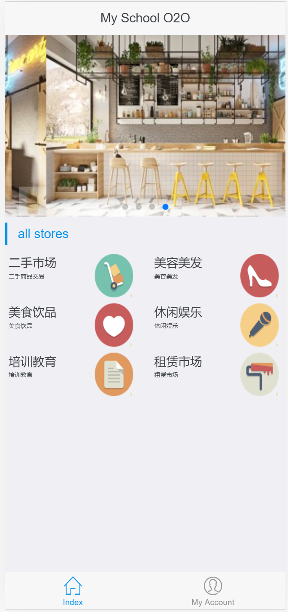
</div>
<br> 

*Shop List* page:
<div>
  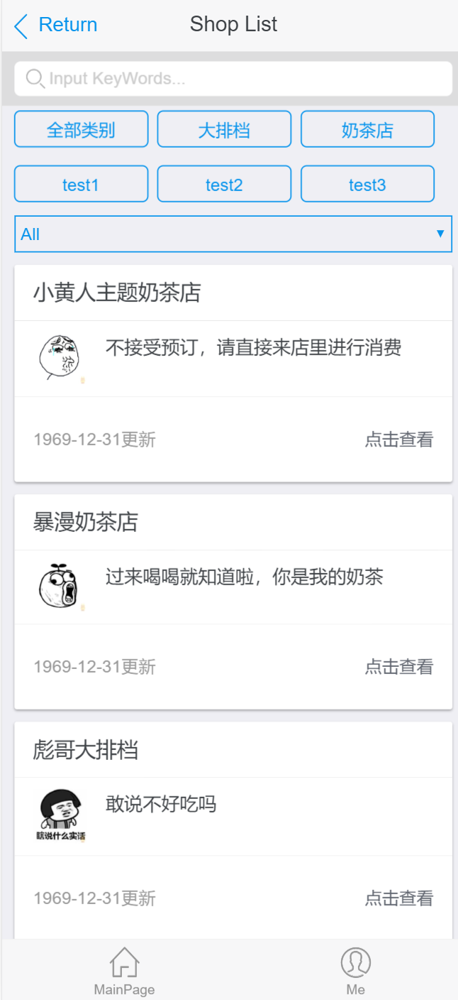
</div>
<br> 

*Shop Detail* page:
<div>
  
</div>
<br> 

*Product Detail* page:
<div>
  
</div>
<br> 

3. **Authorization Pages**:

*Create Account* page:
<div>
  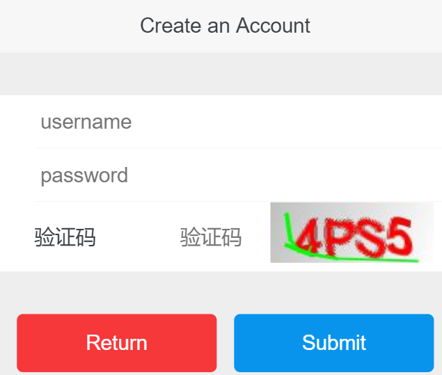
</div>
<br>

*Login* page:
<div>
  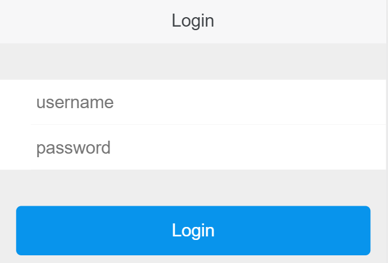
</div>
<br> 

*Change Password* page:
<div>
  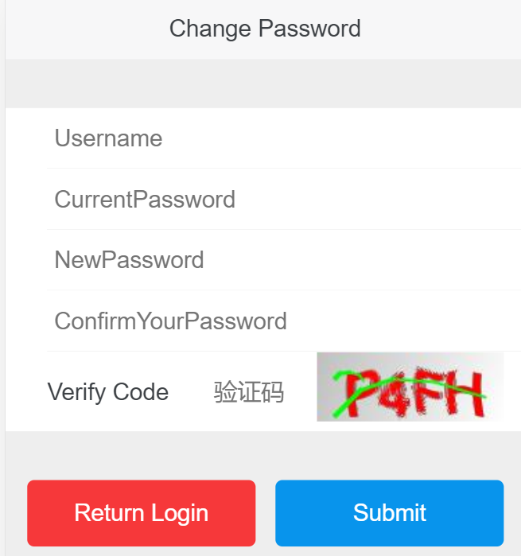
</div>
<br> 

4. **Back-End Pages**:

*Shop List* page:
<div>
  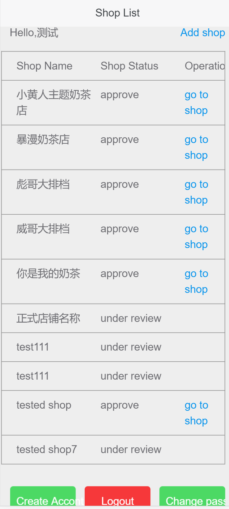
</div>
<br> 

*Shop Management* page:
<div>
  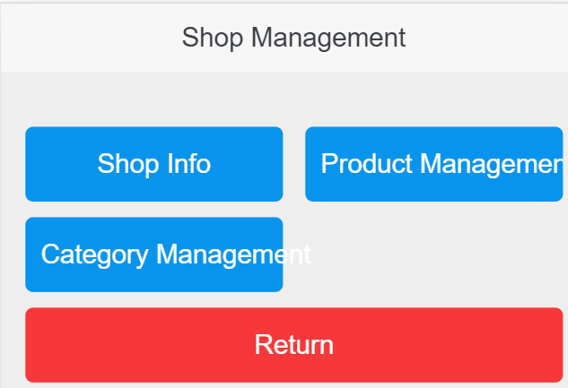
</div>
<br> 

*Shop Info* page:
<div>
  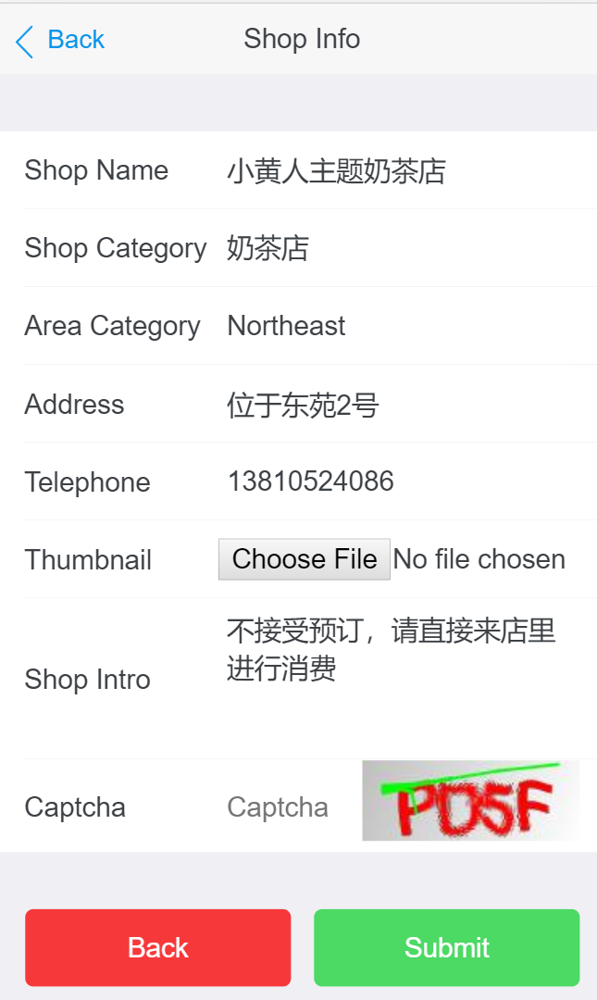
</div>
<br> 

*Category Management* page:
<div>
  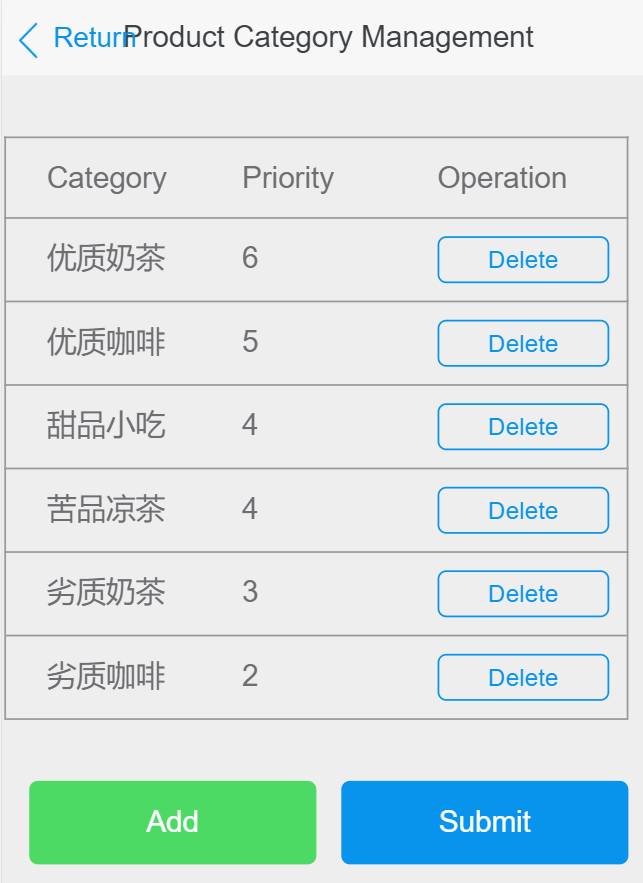
</div>
<br> 

*Product Management* page:
<div>
  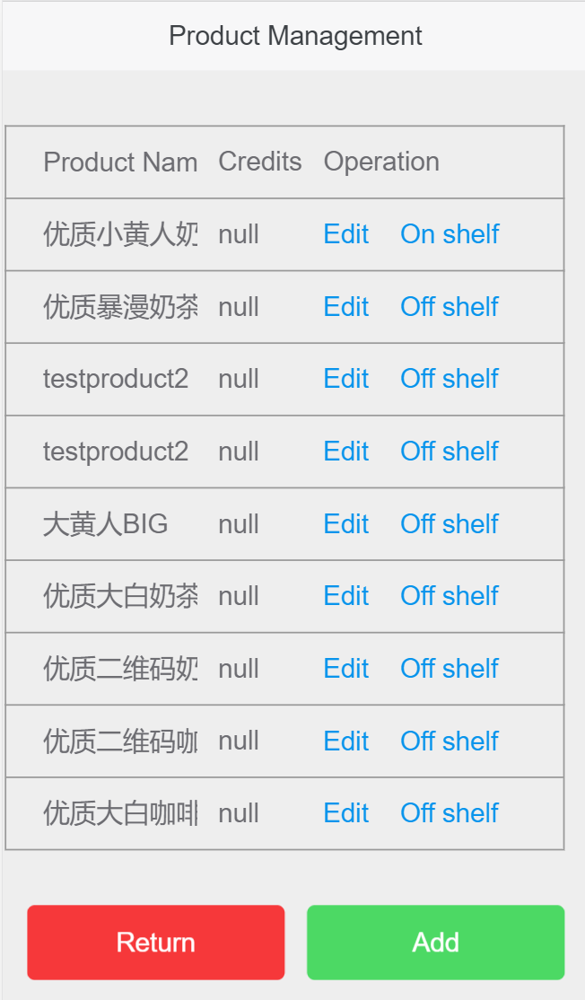
</div>
<br> 

*Product Operation* page:
<div>
  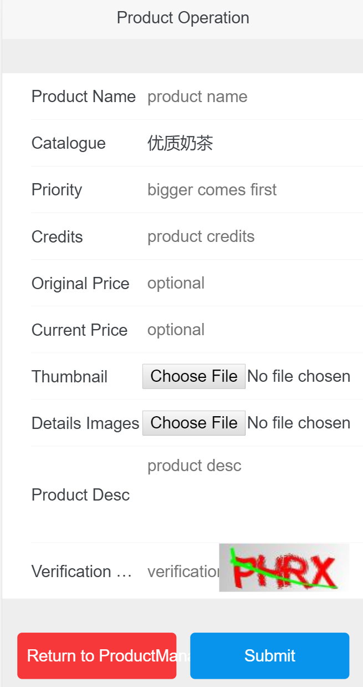
</div>
<br> 

#

## Getting Started

- Clone the project 
```
git clone  https://github.com/tongshi049/springmvc_shop.git
```
- Go to the project folder and import it as a maven project in `eclipse` or `IntelliJ IDEA`, configurate tomcat and run tomcat.

#

## Project Structure

A classcial Maven project structure

```
src/                        project source code
|- main/                     
|  |- java/                 main java code
|  |- ...
|  |- resources/            includes configuration files, mappers
|  |- webapp/               web app sources 
|  |- |- resources          css and js files
|  |- |- WEB-INF            html pages (users cannot visit directly)
|  |- |- index.jsp          app index page
|- test/                    test files
target/                     default maven output folder
pom.xml                     information about the project and configuration details used by Maven to build the project
```

#

### Dependencies

- spring-core, spring-beans, spring-context, spring-jdbc, spring-tx, spring-web, spring-webmvc, spring-test: 4.3.7.RELEASE
- junit: 4.12
- logback-classic: 1.2.3
- javax.servlet-api: 3.1.0
- jackson-databind: 2.8.7
- commons-collections: 3.2
- mybatis-spring: 1.3.1
- mysql-connector-java: 8.0.16
- c3p0: 0.9.1.2
- jedis: 2.9.0
- kaptcha: 2.3.2
- commons-fileupload: 1.3.2

#

### Libraries

- [Spring](https://spring.io/).
- [SpringMVC](https://docs.spring.io/spring/docs/3.2.x/spring-framework-reference/html/mvc.html).
- [MyBatis](http://www.mybatis.org/mybatis-3/).
- [SUI Mobile](http://m.sui.taobao.org/).
- [Logback Classic Module](https://mvnrepository.com/artifact/ch.qos.logback/logback-classic).
- [Thumbnailator](https://github.com/coobird/thumbnailator).
- [Jedis](https://github.com/xetorthio/jedis).
